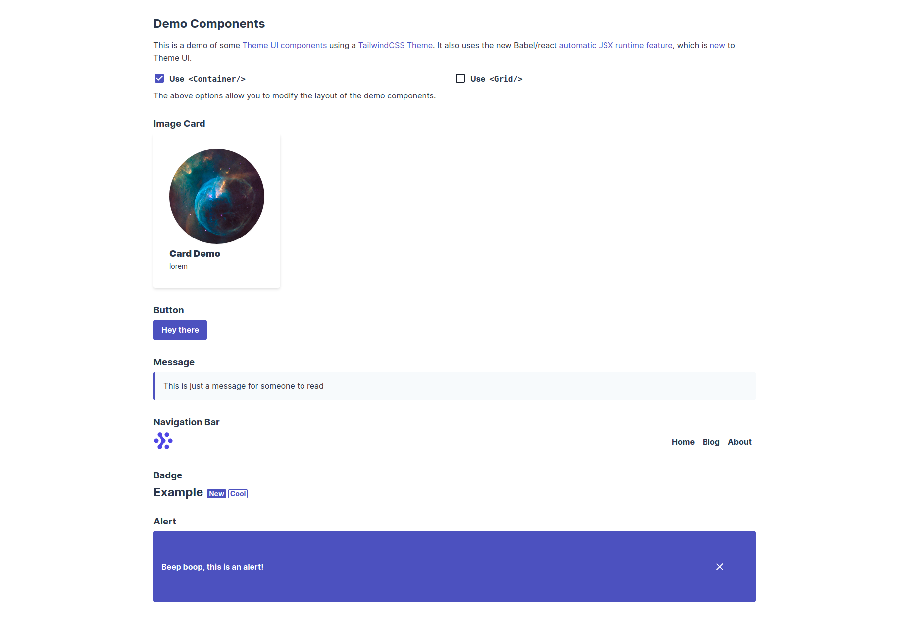

# Theme UI TailwindCSS Demo

This is a demo of some [Theme UI components](https://theme-ui.com/components) using a [TailwindCSS Theme](https://github.com/system-ui/theme-ui/pull/1243). It also uses the new Babel/React [automatic JSX runtime feature](https://reactjs.org/blog/2020/09/22/introducing-the-new-jsx-transform.html), which is [new](https://github.com/system-ui/theme-ui/blob/develop/CHANGELOG.md#v050-alpha1-2020-11-26) to Theme UI.

